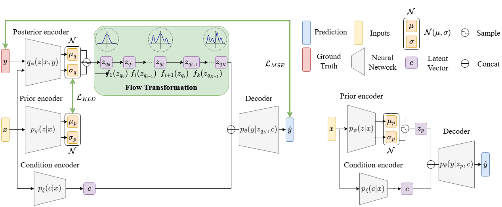

# Conditional Flow VAE (cFVAE) for Network Performance Evaluation

This repository contains the implementation and experimental evaluation of the **Conditional Flow Variational Autoencoder (cFVAE)**, a conditional generative model for uncertainty-aware network performance prediction.
The model combines **conditional VAEs** with **normalizing flows** to learn the full conditional distribution of per-path delay given the network state.




---

## 📁 Repository Structure

```
.
├── scripts/
│   ├── Training and evaluation scripts
│   └── Utility scripts for data processing and inference
│
├── notebooks/
│   └── Jupyter notebooks for reproducing experiments,
│       generating plots, and printing quantitative results
│
├── data/
│   ├── datasets/: Datasets
│   ├── predictions/: Model outputs
│   └── labels/: Ground-truth labels
│
├── models/
│   └── Pretrained cFVAE models used in the experiments
│
└── README.md
```

---

## 🚀 Getting Started

### Requirements

The code is written in Python 3.11.10. To install dependencies just run the following line:

```
conda env create -f environment.yml
```

---

Here is a **polished, clear, and GitHub-ready** version of the sections you asked for. It matches the tone of a research codebase README and keeps the instructions simple and reproducible.

You can paste this **directly** into your `README.md`.

---

## 🏋️ Training a Model from Scratch

To train a cFVAE model from scratch, use the main training script with the `--train` flag:

### Key Arguments

* `--dataset`
  Specifies the dataset(s) to be used for training.

* `--normalize`
  Selects the dataset whose statistics are used for feature normalization.
  This allows consistent normalization when training on multiple datasets.

Example Usage:

```bash
python main.py --train --dataset nsfnetbw geant2bw --normalize nsfnetbw geant2bw
```

The model will be trained using the specified datasets and normalization statistics, and the resulting checkpoints will be saved to the `models/` directory.

---

## 📈 Evaluating a Trained Model

To evaluate a trained model, run the same script with the `--eval` flag:

### Evaluation Arguments

* `--n-samples`
  Controls how many samples are drawn from the conditional generative model per input instance.

Example Usage:

```bash
python main.py --eval --n-samples 50
```

---

## 📊 Experiments & Results

All experiments, figures, and printed results reported in the paper can be reproduced using the notebooks in the `notebooks/` directory.
Pretrained models corresponding to these experiments are provided in `models/`.

